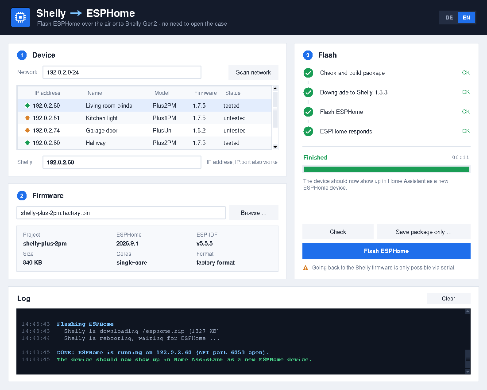
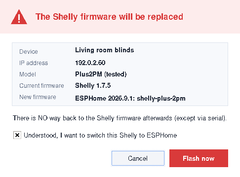

# shelly2esphome

Convert Shelly devices running the original firmware to **ESPHome over the air**.
Gen2 uses the existing conversion flow; selected Gen3 and Gen4 devices have a separate,
explicitly enabled **experimental** flow with preflight checks and diagnostic reports.

Python standard library only, GUI and CLI, Windows and Linux. No serial adapter is needed
for the conversion itself. Failed conversions or unsuitable ESPHome builds may require
serial recovery.

[Device support](#device-support) · [Download](#download-and-requirements) ·
[Gen2 guide](#gen2-conversion) · [Gen3 / Gen4 guide](#gen3--gen4-experimental-conversion) ·
[CLI options](#cli-reference) · [Test reports](#testing-and-feedback) · [Deutsch](#deutsch)

> Converting replaces the manufacturer's firmware. Returning to Shelly firmware normally
> requires a serial adapter. Gen3/Gen4 profiles have **not been validated on physical
> hardware by this project**. A listening ESPHome API port alone does not prove that the
> new bootloader, device functions or future OTA updates work.



## Device support

Support applies to the individual model, not to an entire generation.

| Generation | Model / profile | Chip | Status |
|------------|-----------------|------|--------|
| Gen2 | Plus 2PM (`Plus2PM`) | ESP32 | Hardware tested: stock 1.7.1 / 1.7.5 → ESPHome 2026.9.1 |
| Gen2 | Plus 1, Plus 1PM, Plus I4, Plus Plug S, Plus Uni | ESP32 | Untested; included in the existing Gen2 flow |
| Gen3 | Plug S Gen3 (`PlugSG3`) | ESP32-C3, 8 MB | Experimental profile; no hardware validation yet |
| Gen4 | 2PM Gen4 (`S2PMG4`) | ESP32-C6, 8 MB | Experimental profile; no hardware validation yet |
| Other | Gen2 Mini series and other models | Various | No conversion profile; unknown models can supply read-only diagnosis |

**Tested** means a real device was tested, not merely that automated tests passed.
Experimental profiles remain experimental until actual conversion, reboot, device-function
and subsequent OTA results have been reviewed. No automatic promotion takes place.

The GUI and Gen2 flow have been used on Linux and Windows 11. Automated tests run on both
Linux and Windows; this does not establish Gen3/Gen4 hardware compatibility.

## Download and requirements

### Windows without Python

- **Gen2:** download `shelly2esphome.exe` from the [latest release](https://github.com/senfkorn/shelly2esphome/releases/latest).
- **Gen3/Gen4 testing:** use a current Windows build from [Windows-Release Actions](https://github.com/senfkorn/shelly2esphome/actions/workflows/release.yml).
  Open a successful run for `main`, scroll to **Artifacts**, download `shelly2esphome-windows`
  and extract it. GitHub artifact downloads require signing in.
  [First successful build containing experimental support](https://github.com/senfkorn/shelly2esphome/actions/runs/37917265535).
- `shelly2esphome.exe` opens the GUI; `shelly2esphome-cli.exe` provides the CLI.
  `SHA256SUMS.txt` contains checksums. The executables are unsigned; Windows SmartScreen
  may require “More info” → “Run anyway”.

**The v1.0.0 release binaries do not contain experimental support.** Builds from `main`
are testing artifacts, not a new stable release.

### Run from source

Python 3.8 or newer; no pip packages are needed. Clone the repository or extract the
[complete source ZIP](https://github.com/senfkorn/shelly2esphome/archive/refs/heads/main.zip).
Keep `shelly2esphome.py`, `shelly2esphome.pyw` and `experimental.py` together.

```bash
git clone https://github.com/senfkorn/shelly2esphome.git
cd shelly2esphome
python shelly2esphome.py
```

On Linux, use `python3` and install Tk for the GUI, for example `sudo apt install python3-tk`.
On Windows with Python installed, double-click `shelly2esphome.pyw` to open the GUI without
an additional console window.

### Network and firmware

- PC and device must be reachable on the same network. The device downloads the package
  **from the PC**; allow incoming HTTP connections through the PC firewall.
- Password-protected Shelly RPC is not supported. The tool does not disable authentication.
- The ESPHome build must include working Wi-Fi, `api:` and `ota:` with the ESPHome platform.
  An appropriate fallback access point is useful if Wi-Fi does not reconnect.
- Experimental flashing also needs incoming UDP logs from the device. Devices with enhanced
  security requiring HTTPS update transport are blocked; security settings are not disabled.
- A firmware ZIP or BIN can contain compiled credentials. Never attach these files to a
  public issue.

## Gen2 conversion

### GUI

1. Scan the network or enter the Shelly IP address in the main window.
2. Select an ESPHome BIN: ESPHome dashboard → Install → Manual download.
   **Factory format** is recommended; OTA format is also accepted for Gen2.
3. Choose **Check** to read the device information, validate the firmware and build the
   package without changing the device. **Save ZIP** saves the package locally.
4. Choose **Flash ESPHome**, review the device and firmware details, and confirm.
5. The tool performs the stock downgrade if needed, installs ESPHome and checks port 6053.
   Then connect through ESPHome / Home Assistant and check the actual device functions.



The top-right language switch selects English or German. Its setting is saved in
`~/.shelly2esphome.json`. The main Gen2 controls do not enable experimental profiles.

### CLI

```bash
# Read-only preflight
python shelly2esphome.py --cli 192.168.1.50 firmware.factory.bin --check

# Build a ZIP locally, without changing the device
python shelly2esphome.py --cli 192.168.1.50 firmware.factory.bin --build-only

# Convert after interactive confirmation
python shelly2esphome.py --cli 192.168.1.50 firmware.factory.bin
```

### Gen2 firmware settings

A starting configuration for the Plus 2PM is provided in
[examples/shelly-plus-2pm.yaml](examples/shelly-plus-2pm.yaml): two relays and two inputs.
It is not a complete implementation of all factory features or protection functions.

Older revisions have a **single-core ESP32 rated for 160 MHz**. Use compatible settings:

```yaml
esp32:
  board: esp32dev
  framework:
    type: esp-idf
    sdkconfig_options:
      CONFIG_FREERTOS_UNICORE: y
      CONFIG_ESP_DEFAULT_CPU_FREQ_MHZ_160: y
      CONFIG_ESP_DEFAULT_CPU_FREQ_MHZ_240: n
```

The tool warns about builds without the single-core setting. It cannot detect the CPU
frequency. These Gen2 settings and the bundled Gen2 bootloader do not apply to C3/C6 devices.

For a Gen2 factory BIN, the build's bootloader is extracted. For an OTA BIN, the bundled
ESPHome 2026.9.1 bootloader is used unless `--bootloader` supplies another one.

### Gen2 stock firmware and update flow

The converter checks the image, checksum, SHA-256 and app size, then builds a **stored,
uncompressed ZIP** containing the ESPHome app and bootloader with the Shelly partition table.

It downloads stock **1.3.3** from `http://rojer.me/files/shelly/stock/1.3.3/` as needed,
checks a built-in SHA-256 pin, downgrades the device, calls `OTA.Commit` to prevent rollback,
and verifies the downgrade with a reboot. It then serves the conversion package through a
local HTTP server and calls `Shelly.Update`.

For offline use, put `<Model>-1.3.3.zip` into `firmware/` beside the script or supply
`--shelly-zip`. Stock firmware is not included in this repository.
The Gen2 layout retains two 1.5 MB OTA slots for subsequent ESPHome updates.

## Gen3 / Gen4 experimental conversion

This is a separate opt-in flow for **PlugSG3** and **S2PMG4**. It does not use the Gen2
1.3.3 downgrade or the embedded ESP32 bootloader. Read the
[detailed experimental guide](docs/EXPERIMENTAL.md) before a hardware test.

### GUI workflow

1. Open **Gen3 / Gen4 (experimental)** from the main window.
2. Enter the device IP and choose **Diagnose**. No firmware is needed; this only reads
   device information. Unknown models can use this step too.
3. Select an **official stock ZIP matching the exact model and currently installed
   firmware version**. The tool does not download Gen3/Gen4 stock firmware or authenticate
   the selected archive independently; obtain it from an official source.
4. Choose **Export CSV** to export the complete stock partition layout for your ESPHome build.
5. Build ESPHome for the correct chip and layout, then select the resulting **factory BIN**.
6. Choose **Preflight**. This checks chip, image checksums, matching stock version,
   partition layout, app size, flash settings, silicon revision constraints and update transport.
   It does not change the device. **Save ZIP** also leaves the device unchanged.
7. Choose **Flash (experimental)** only after reviewing the checks and recovery requirements.
   The tool probes the target slot before issuing the update.
8. Keep the window open, perform the hardware tests below, enter the results and choose
   **Export diagnostic JSON / Diagnose exportieren**. Attach the report yourself to a test issue.

### CLI workflow

Replace `DEVICE_IP` with the device address. Examples use separate reports so an earlier
attempt is not overwritten.

```bash
# Diagnosis: no firmware and no device writes
python shelly2esphome.py --cli DEVICE_IP --diagnose --report diagnosis.json

# Export the full stock layout before building ESPHome
python shelly2esphome.py --cli DEVICE_IP --experimental --shelly-zip stock.zip --export-partitions stock-partitions.csv --report layout.json

# Validate a factory BIN without changing the device
python shelly2esphome.py --cli DEVICE_IP firmware.factory.bin --experimental --shelly-zip stock.zip --check --report preflight.json

# Build the conversion ZIP locally
python shelly2esphome.py --cli DEVICE_IP firmware.factory.bin --experimental --shelly-zip stock.zip --build-only --report package.json

# Convert: interactive confirmation requires typing FLASH
python shelly2esphome.py --cli DEVICE_IP firmware.factory.bin --experimental --shelly-zip stock.zip --report conversion.json
```

`--yes` explicitly skips the interactive confirmation. It does not bypass chip, layout,
security or target-slot guards. `--check`, `--build-only`, `--diagnose` and
`--export-partitions` are mutually exclusive modes.

### Experimental firmware settings

Use **ESP-IDF**, the correct **8 MB C3/C6 target**, and the complete CSV exported from
that device's matching stock ZIP. For PlugSG3:

```yaml
esp32:
  board: esp32-c3-devkitm-1
  variant: ESP32C3
  flash_size: 8MB
  partitions: stock-partitions.csv
  framework:
    type: esp-idf
    sdkconfig_options:
      CONFIG_PARTITION_TABLE_OFFSET: '0x10000'
    advanced:
      enable_ota_rollback: false
api:
ota:
  - platform: esphome
```

For **S2PMG4**, change the board to `esp32-c6-devkitm-1` and the variant to `ESP32C6`.
These are build settings, **not a complete device configuration**. Add Wi-Fi, the actual
GPIO assignments and any required temperature/power protections; validate those separately.

The expected offsets are bootloader `0x0`, partition table `0x10000`, OTA data `0x11000`
and app `0x20000`. App slots are `0x2a0000` bytes for PlugSG3 and `0x300000` bytes for
S2PMG4. Both OTA slots and **all** data partitions must match the stock table exactly.
A generic ESPHome layout, an OTA-only BIN or a Gen2 bootloader is rejected.

### Slot and bootloader guards

After confirmation, the tool temporarily changes the device's UDP debug destination and
reads only `Storing core dumps to app_0` / `app_1` indications from that device's IP.
It restores and verifies the old UDP destination **before** starting the update.
Only an unambiguous **target slot 0** is accepted; `GetDeviceInfo.slot` alone is insufficient.

If the target is slot 1, use the official Shelly procedure to update/reinstall stock firmware
and try again. There is no automatic slot switch, forced override or security downgrade.
If UDP logging cannot identify the slot, the tool stops before flashing.

The package preserves the stock data parts and replaces the bootloader/app. It uses the
public experimental conversion approach with `boot.min_version` set to `1.0.9`.
Unknown or higher stock bootloader minima, signed/encrypted images and incompatible layouts
are blocked. **Bootloader replacement is not independently verified on hardware.**

## CLI reference

Use `shelly2esphome-cli.exe` instead of `python shelly2esphome.py` when using the Windows binary.

| Option | Meaning / scope |
|--------|-----------------|
| `--cli` | Use the command line instead of launching the GUI |
| `--scan NET` | Discover Shellys on a network; discovery does not imply conversion support |
| `--check` | Read-only preflight and package validation |
| `--build-only` | Save a conversion package locally; no device changes |
| `--experimental` | Explicitly enable the PlugSG3 / S2PMG4 conversion profiles |
| `--diagnose` | Read-only device diagnosis, including unknown models; no firmware required |
| `--export-partitions CSV` | Export the full stock table; requires `--experimental` and `--shelly-zip` |
| `--shelly-zip FILE` | Gen2: pinned 1.3.3 archive; experimental: official archive matching current model/version |
| `--report JSON` | Save an experimental/diagnosis report, including failed attempts |
| `--test-result TEST=RESULT` | Add manual results to that report; details below |
| `-y`, `--yes` | Skip confirmation; Gen2 multicore builds also require `--allow-multicore` |
| `--allow-multicore` | Gen2 only; accept the multicore warning noninteractively |
| `--bootloader FILE` | Gen2 custom bootloader; experimental flow requires the factory BIN's bootloader |
| `--port N` | Local HTTP-server port; default is a random available port |
| `--lang de\|en` | Main GUI/CLI language; experimental controls/help also contain English text |

Set `S2E_DEBUG=1` for detailed local HTTP logging. Those logs are not the diagnostic report
and may expose local addresses or identifiers. Do not post them without reviewing/redacting them.

## Testing and feedback

A successful conversion needs more evidence than an open TCP port. Please test and record:

1. First boot and an actual ESPHome API connection.
2. Reboot or power cycle, followed by reconnection.
3. A normal ESPHome OTA update to a **different build**, followed by reboot and reconnection.
4. A second OTA update to another **different build**, followed by reboot and reconnection.
5. Configured relays, inputs, power/temperature measurements and protection functions.

The converter does not perform these follow-up hardware tests automatically.
In the experimental GUI, enter `passed`, `failed` or `unknown` for `boot`, `reboot`,
`ota1`, `ota2` and `functions`, then export the JSON report. Results are manual observations.
The CLI can also attach manual observations to the report produced by a run, for example
`--test-result reboot=passed`; it does not edit a previously saved report.

Use the [experimental test issue template](https://github.com/senfkorn/shelly2esphome/issues/new?template=experimental-test.yml)
for successful, failed and blocked attempts. Include the tool commit, model/hardware revision,
stock and ESPHome versions, report JSON, test results and whether serial recovery was needed.
For an unknown model, submit its read-only diagnosis and the model description.

### Diagnostic privacy

Reports contain only selected technical fields: schema/feature revision, profile, generation,
plausibly formatted stock version, input SHA-256 hashes, checked chip/layout sizes and offsets,
target slot, guard/flow outcomes and manual test results.

They do **not** contain IP/MAC addresses, device names, local file paths, credentials,
YAML contents, raw RPC responses, raw logs or exception messages. Failed CLI attempts also
export a report when `--report` is set and the destination is writable.

There is **no automatic upload or telemetry**. Review the exported JSON before attaching it
to a public issue. BIN, ZIP and YAML files are not suitable diagnostic attachments.

## Troubleshooting

| Symptom / check | What to do |
|-----------------|------------|
| Password-protected RPC | Authentication is unsupported; review the device's access settings before testing. |
| `profile` / `profile_and_stock_required` | Only PlugSG3 and S2PMG4 have experimental package profiles; other models can use diagnosis. |
| `factory_and_stock_required` | Supply both a factory BIN and the matching official stock ZIP. |
| `stock_identity` / `package_layout` | Check exact model, installed stock version, complete CSV, target chip and factory build. |
| `https_required` / `security_state_unknown` | Enhanced-security or unknown transport state is blocked. This flow supports local HTTP updates only. |
| `target_slot_zero_required` | Allow incoming UDP, then recheck. For slot 1, manually update/reinstall stock firmware through Shelly's official procedure. |
| `debug_restore_failed` | No update is started. Restore the previous UDP debug destination in Shelly settings before another attempt. |
| Device never downloads the package | Check PC firewall, local HTTP port and network/VLAN connectivity. |
| Gen2 rolls back to its previous stock version | Commit/reboot verification failed; stock is still present. Recheck connectivity and retry. |
| Shelly rejects the package | Stock firmware is still reachable. Report the failure; do not bypass experimental guards. |
| Device becomes unreachable | Check Wi-Fi/fallback hotspot; serial recovery may be necessary. An API-port observation does not establish hardware success. |
| Experimental controls are missing | Use current source or a current main-build artifact; v1.0.0 contains Gen2 only. |

## Development and builds

```bash
python dev/test_shelly2esphome.py
python dev/test_experimental.py
python dev/mockshelly.py --scenario normal
```

The Gen2 tests use a loopback-only mock implementing rollback and update rejection.
Experimental tests use synthetic C3/C6 images and mocked RPC to check package validation,
read-only operations, slot/security guards, logging restoration and report privacy.
Real-firmware tests are skipped unless their external fixtures are available.

[Tests workflow](.github/workflows/test.yml) runs on Linux and Windows for pushes and pull requests.
[Windows build workflow](.github/workflows/release.yml) runs tests, builds GUI/CLI executables with
PyInstaller, performs CLI smoke tests and uploads checksums plus binaries.

- Push to `main` or manual workflow dispatch: build artifacts, no stable release.
- Push a `v*` tag: attach the executables to a GitHub release.

To add an experimental model, provide an exact device identity, chip and partition layout,
then add validation tests and obtain hardware evidence. A generation number or a successful
report from another converter is insufficient to mark this tool's profile as tested.

## Credits and technical references

- Gen2 package format: [mgos32-to-tasmota32](https://github.com/tasmota/mgos32-to-tasmota32).
- Gen2 stock firmware archive: rojer.me.
- Gen3 layout and target-slot observations: [free-shelly-ota](https://github.com/oxynatOr/free-shelly-ota).
- Gen4 layout and package documentation: [shelly-gen4-esphome](https://github.com/automatous-io/shelly-gen4-esphome).
- [Shelly Sys RPC / UDP logging documentation](https://shelly-api-docs.shelly.cloud/gen2/ComponentsAndServices/Sys/).
- Further implementation details and source links: [experimental guide](docs/EXPERIMENTAL.md).

Not affiliated with Shelly or ESPHome / Open Home Foundation.

## License

[GPL-3.0-or-later](LICENSE). Shelly stock firmware is not distributed in this repository.

## Deutsch

ESPHome per OTA auf Shelly-Geräte mit Herstellerfirmware installieren. Plus 2PM Gen2 wurde
auf echter Hardware getestet; Plug S Gen3 und 2PM Gen4 sind **experimentell und noch nicht
auf echter Hardware durch dieses Projekt validiert**.

- **Gen2:** aktuelles Release verwenden, Gerät und Firmware im Hauptfenster wählen,
  prüfen und nach Bestätigung flashen.
- **Gen3/Gen4:** aktuellen Quellcode oder ein erfolgreiches Windows-Artefakt von `main`
  verwenden. Im Fenster **Gen3 / Gen4 (experimental)** zunächst Diagnose ausführen,
  passendes offizielles Stock-ZIP auswählen, CSV exportieren, passende Factory-BIN bauen
  und die Vorabprüfung durchführen. Die v1.0.0-EXE enthält diesen Pfad noch nicht.
- Nach dem Flashen echte API-Verbindung, Neustart und **zwei weitere unterschiedliche
  OTA-Builds** sowie die Gerätefunktionen testen. Ergebnisse manuell eintragen und den
  Diagnosebericht über die Issue-Vorlage zurückmelden.
- Berichte werden nur lokal gespeichert. Keine automatischen Uploads; keine BIN-, ZIP-
  oder YAML-Dateien öffentlich anhängen. Bei einem Fehler kann serielle Rettung nötig sein.

Die vollständige Anleitung steht oben auf Englisch. Eine ausführliche deutsche
Experimental-Anleitung liegt unter [docs/EXPERIMENTAL.md](docs/EXPERIMENTAL.md).
